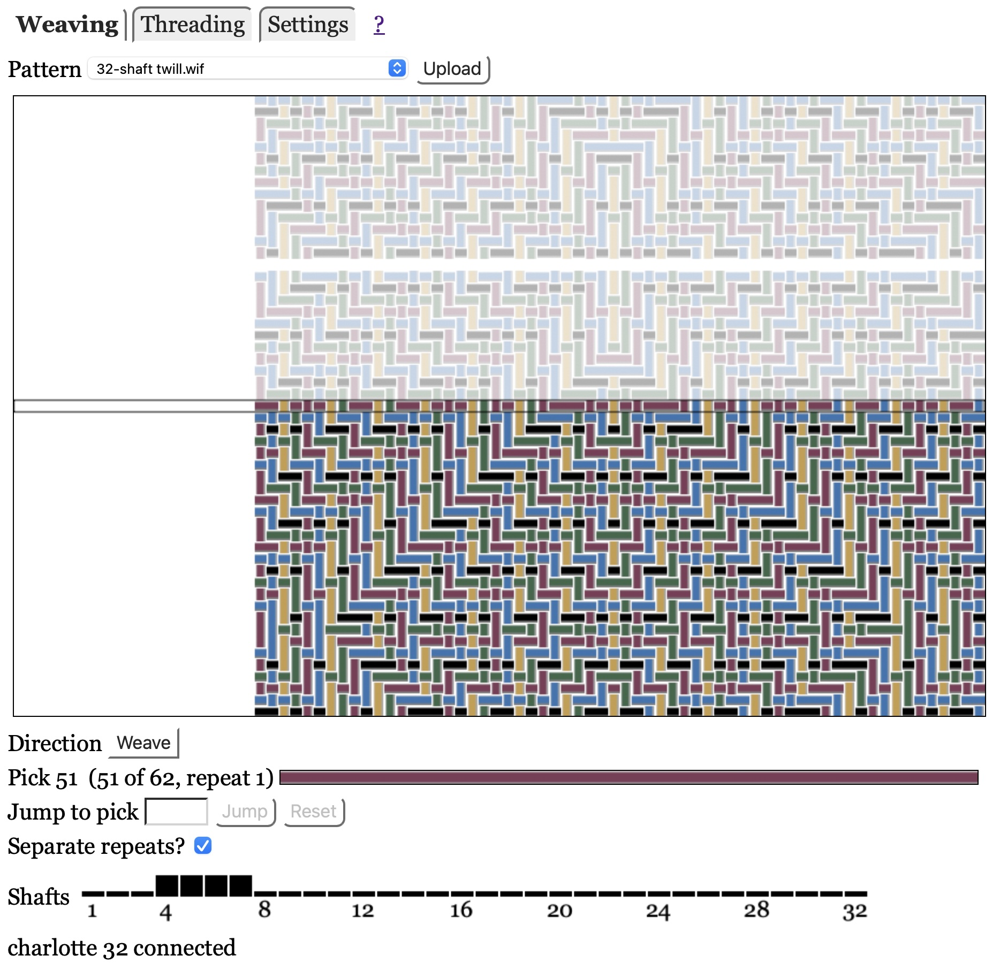
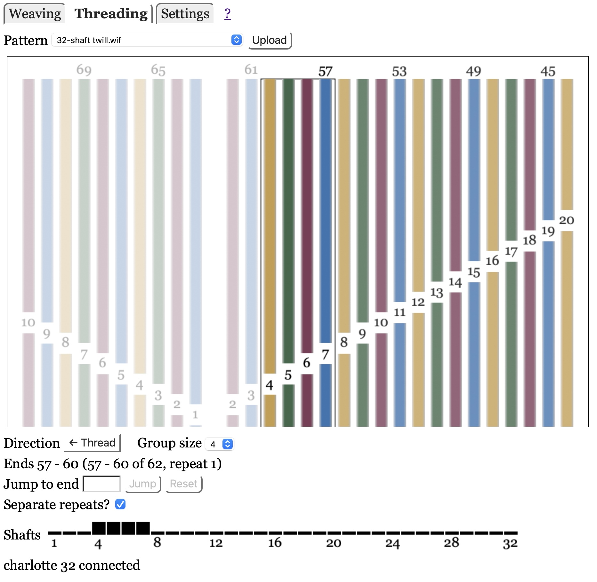

# Loom Server

A loom server allows you to control a computer-controlled loom from a web browser on a phone, tablet or computer.

Click an image to see a gallery of screen shots.

Features include:

* Direct support for three types of weaving pattern files: WIF (.wif), Fiberworks (.dtx), and WeavePoint (.wpo).
* Support for weaving and threading.
* Settings to accommodate your preferences.
* Preliminary support for multiple languages (the translation files need work; [contributions welcome](translations.md)).
* Runs on all major operating systems.
* The software is free and uses the generous MIT license.

I maintain software to control [Toika](https://pypi.org/project/toika-loom-server/)
and [Séguin](https://pypi.org/project/seguin-loom-server/) looms.
The base package [base_loom_server](https://pypi.org/project/base-loom-server/) does most of the work,
so it is easy to [support other looms](coding.md#writing-a-loom-server).

This document explains how to use these loom servers.

The first step is to [install](installing.md) the software. Once you have done that, read on:

## Connect to the Loom Server

Connect to the loom server using any modern web browser (e.g. on a phone, tablet, or laptop).
The address will be "http://*hostname*.local:8000" where *hostname* is the host name
of the loom server computer, as determined in [Installing](installing.md).

If you are running the web browser and web server on the same computer, you can skip the hostname and connect to "http://localhost:8000".

## Select the Mode

The server has three modes, which are listed at the top of the web page:

* [Weaving](weaving.md) is used to weave fabric; this is by far the most common mode.

* [Threading](threading.md) helps you thread the loom, by lifting shafts for groups of threads.

* [Settings](settings.md) allows you specify settings that apply to all weaving pattern files.

Click on the word to select that mode.
The bold word shows the current mode.

The links above give detailed instructions for each mode.
But before you dive into that, read the next section about pattern files:

In addition, the "?" link on the same line as the mode tabs opens documentation in a new browser tab.

## Upload and Select Pattern Files

Before you can weave or thread, you must upload one or more pattern files to the loom server.
The server accepts WIF (.wif), Fiberworks (.dtx), and WeavePoint (.wpo) files.

There are two ways to upload files:

* Push the "Upload" button.
* Drag and drop the files onto the web page (making sure the web page is gray before dropping them).

Once you have uploaded patterns, you can select one using the menu labeled "Pattern" (next to the "Upload" button).

The loom server remembers the 25 most recent patterns that you have uploaded,
and this information is saved on disk, so should not be lost in a power failure.

The saved information includes the most recent pick (weaving) and the most recent warp thread group (threading).
This allows you to switch between different patterns while weaving something.
However, if you upload a new pattern with the same file name as a saved pattern,
the new pattern overwrites the old and the pick and warp thread group information is reset.
So please be careful.

To clear out the pattern menu (which may become cluttered over time),
select "Clear Recents", the last item in the pattern menu.
This clears out information for all patterns except the current pattern.

## Multiple Connections

The server only allows one web browser to connect, and the most recent connection wins.
This prevents a mystery connection from hogging the loom.
If the connection is dropped on the device you want to use for weaving,
simply reload the page to regain the connection.

## Reset the Loom Connection

Every time you connected to the web server or reload the page, the server refreshes
its connection to the loom (by disconnecting and immediately reconnecting).
So if the server is reporting a problem with its connection to the loom,
and it is not due to the loom losing power, or a disconnected or bad USB cable,
you might try reloading the page.

If the loom seems confused, try turning off the loom, waiting a few seconds, then turning it on again.
Then reload the web page, to force the web server to make a new connection to the loom.

## Acknowledgements

* Early adopters, including WillowGoose ([willowlovestoweave](https://www.instagram.com/willowlovestoweave/) on Instagram), for patiently testing this software and proving valuable feedback.
* Toika for providing the Toika loom API.
* Séguin for providing the Séguin loom API.
* FiberWorks for providing the .dtx file specification.
* WeavePoint for providing the essential parts of the .wpo file specification.
* CrowdIn for providing free use of their language translation site for this project.
* All those who have helped with language translations.
