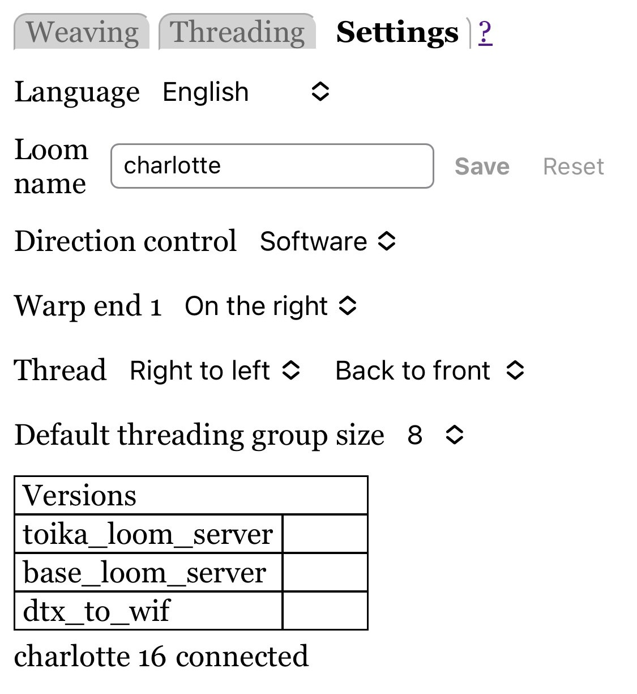

# Settings

The Settings allows you to specify settings that apply to all weaving patterns.
Settings are automatically saved, and should survive rebooting the loom server.

Settings include:

* **Language**: which language to use.
  Note that this is always the first setting, and the settings panel is always the 3rd tab.
  So if the page is a language you don't recognize, click on the first pop-up menu in the settings panel to choose a different language.

  Your help to improve existing translations or add new languages would be much appreciated.
  Read [Translations](translations.md) for more information.

  Note that changing the languages reloads the page. This should be fast and harmless.

* **Loom name**: the name of the loom, as it appears in the display.
  Use any name you like; it is just for display.

* **Direction control**: specify how to change direction (weaving or unweaving, threading or unthreading).
  See [Weave Direction](weaving.md#weave-direction) for more information.
  This setting is not shown for Séguin looms and others that support changing direction from both software and a button on the loom.

* **Warp thread 1**: specify whether to display Warp thread 1 on the right or left
  in the [Weaving](weaving.md) and [Threading](threading.md) pattern displays.
  However, this is as seen *from the front of the loom*.
  If you specify threading front-to-back, the threading pattern is displayed as seen from the back of the loom,
  so end 1 will be on the opposite side than what you specify here.

* **Threading**: specify whether you prefer to thread right-to-left or left-to-right, and front-to-back or back-to-front.
  Specifying front-to-back simply changes the Threading pattern display to appear as if you are sitting behind the castle:
  shaft 1 is displayed at the top and Warp thread 1 is displayed on the opposite side of that specified in "Warp thread 1`".

* **Default threading group size**: specify the threading group size for newly uploaded patterns.
  This setting has no effect on any pattern files that are already loaded;
  use the "Group size" control in the [Threading](threading.md) panel to change those.
