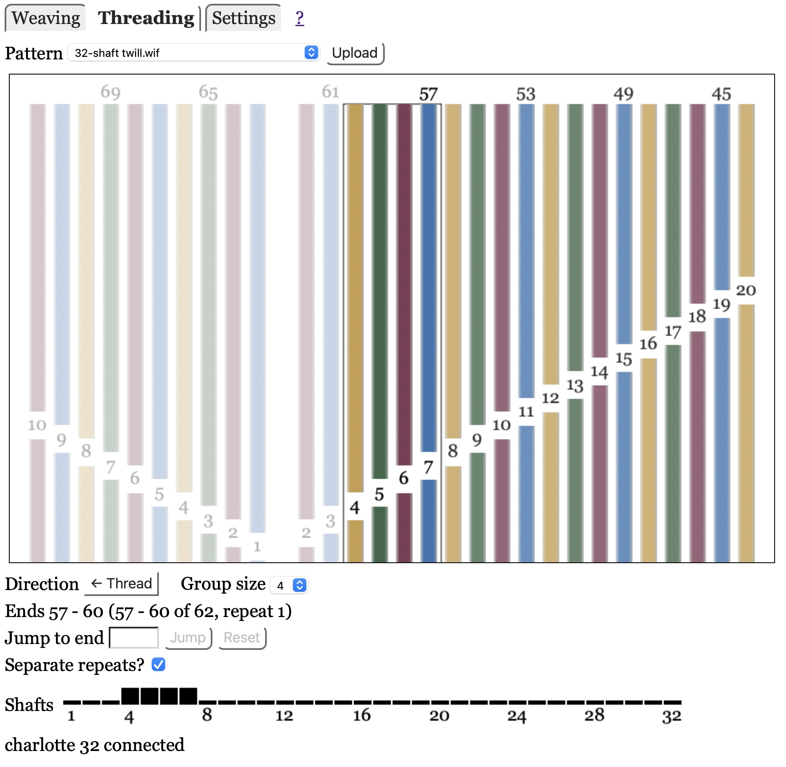
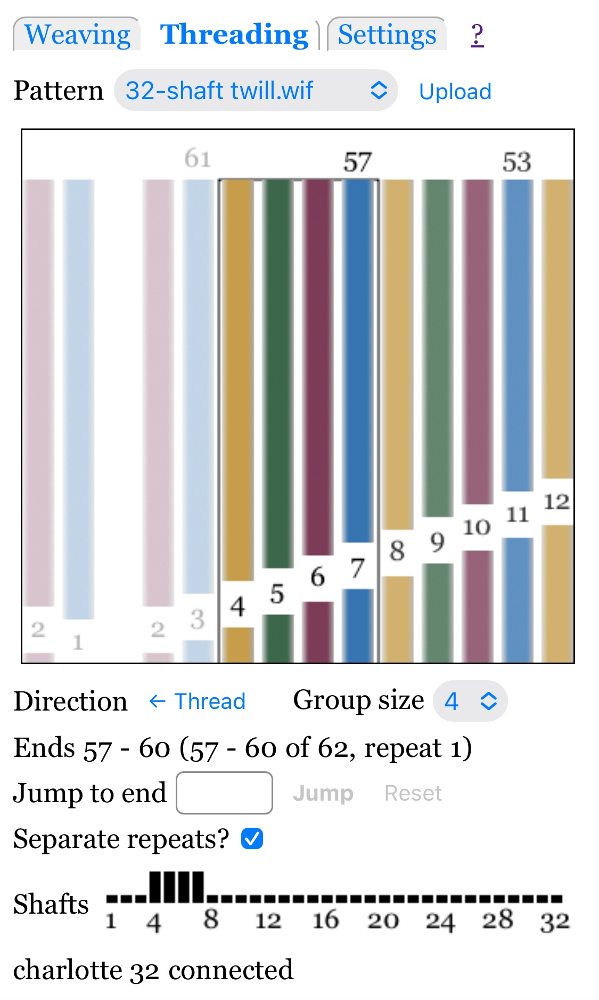

# Threading

The threading mode helps you correctly thread warp strings through the heddles.
Every time you press the pedal, the loom will raise the next group of shafts
and a display will show you which threads belong on which shaft.

This page assumes you have done all the [basics](index.md):

* Connected your web browser to the loom server
* Uploaded at least one pattern, and selected a pattern from the pattern menu
* Selected the Threading mode.

## Threading Direction

The [Settings](settings.md) panel contains two settings specific to threading:

Thread from right-to-left or left-to-right.

Thread from back-to-front or front-to-back, which this only affects the display.
Front-to-back mode rotates the pattern 180 degrees, as if seen from the back of the loom:
shaft 1 is at the bottom, and warp end 1 is at the other edge than specified by the "Warp end 1 on" [setting](settings.md).

## Threading Display

Threading is displayed as a picture that shows a group of threads (vertical colored bars) and the shaft they go through (numbers that interrupt the colored bars).
It also shows warp end numbers above some threads.

If "Separate repeats?" is checked you will see a gap between unthreaded repeats.
See [Repeating](#repeating) for more information.

Special cases that may only be supported by WIF files:

* Ends that are only threaded on shaft 0 (meaning not threaded through heddles on any shaft) are displayed without a shaft number.
* Ends that are threaded through heddles on more than one shaft are only shown threaded on the lowest-numbered shaft (ignoring non-existent shaft 0).

## Threading Direction

See [Weave Direction](weaving.md#weave-direction) for information on changing between threading and unthreading.

If you are using a Toika loom, you must specify whether Software or the Loom controls threading direction in [Settings](settings.md).
If you thread front-to-back, consider specifying Software, because it may be difficult to reach the REVERSE button on the dobby head from behind the castle.

## Jumping

You can jump to a different group of warp ends, specified by the smaller warp end number.
For example if the group size is 4 and you jump to end 21, the new ends will be 21, 22, 23, 24, and 25 (or fewer, if the warp has fewer than 25 threads), regardless of the threading direction.

Jumping is a two-step process: first you request the jump, then you advance to it by pressing the loom's pedal.
(Two steps are necessary because most looms will not accept an unsolicited command to raise shafts.)
In detail:

* Enter the desired warp end number in the box to the right of "Jump to warp thread".
  The box will turn pink and the Jump button will be enabled.

* Press the "return" keyboard key or click the "Jump" button on the web page to send the requested jump to the server.
  You will see several changes:

    * The jump input box will have a white background and the jump button will be disabled.

    * The pattern display will show the new thread group, with a dotted box around it.

* Advance to the next group by pressing the loom's pedal.

* Until you advance to the next group, you may request a different jump (in case you got it wrong the first time) or cancel the jump.
  To cancel the jump you may do any of the following:

    * Press the "Reset" button to the right of "Jump".

    * Reload the page.

    * Select a new pattern.

## Group Size

The "Group size" menu selects how many warp ends are in a group, All shafts for a group are raised at once.

You can change the group size whenever you like; the change takes effect for the next thread group (next time you push the pedal to advance).

## Repeating

The software will automatically repeat threading if you thread beyond the end.
However, like [Weaving](weaving.md), the transition depends on the "Separate repeats?" checkbox:

* "On" (checked): you must advance twice when you reach an end, before the next set of shafts is raised.
  The first advance will lower all shafts, as a signal that you have finished threading or unthreading one pattern repeat. That is the "separator".

* "Off" (unchecked): there is no indication that you have reached the end of threading.
  The next advance will start the next repeat of threading or unthreading.

The default value of "Separate repeats?" is checked (on) if the pattern has more than 20 warp threads, unchecked (off) otherwise.
The idea is that frequent separator "picks" are annoying for short threading sequences, but having a separator "Weft thread" is useful for long sequences.

Note that the value of the Weaving and Threading "Separate repeats?" checkboxes are independent of each other,
and may also be different for different patterns. They are saved in the pattern database.
