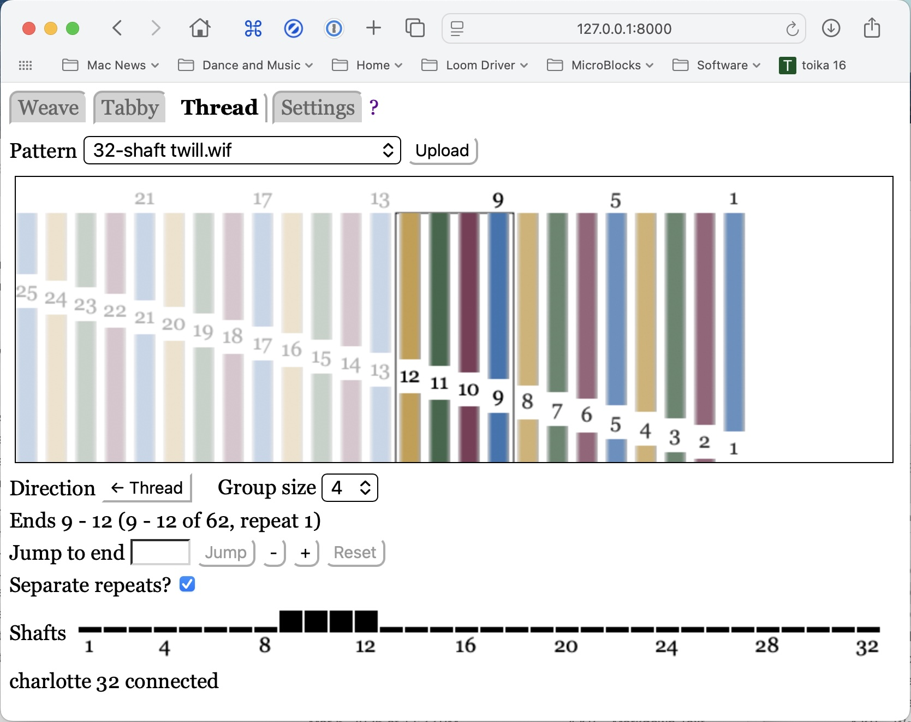
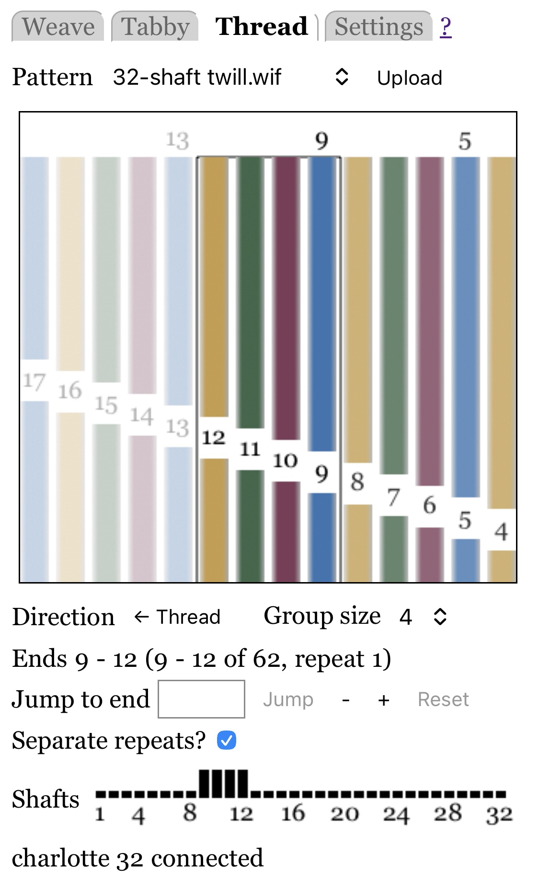

# Threading

The **Thread** mode helps you correctly thread warp strings through the heddles.
Every time you press the pedal, the loom will raise the next group of shafts
and a display will show you which threads belong on which shaft.

This page assumes you have done all the [basics](index.md):

* Connected your web browser to the loom server
* Uploaded at least one pattern, and selected a pattern from the pattern menu
* Selected the Threading mode.

## Threading Direction

The Direction button shows "Thread" or "Unthread", prefixed by an arrow showing the direction of the next group of warp ends.

To change between threading and unthreading see [Weaving: Direction](weaving.md#weave-direction).

The [Settings](settings.md) panel contains two settings specific to threading:

* Thread "right to left" or "left to right".

* Thread "back to front" or "front to back".
"Front to back" rotates the pattern 180 degrees, as if seen from the back of the loom:
shaft 1 is at the bottom, and warp end 1 is at the other edge than specified by the "Warp end 1 on" [setting](settings.md).

If you are using a Toika loom, you must specify whether Software or the Loom controls threading direction in [Settings](settings.md). If you thread "front to back", consider specifying Software, because it may be difficult to reach the REVERSE button on the dobby head from behind the castle.

## Threading Display

Threading is displayed as a picture that shows a group of threads (vertical colored bars) and the shaft they go through (numbers that interrupt the colored bars).
It also shows warp end numbers above some threads.

If "Separate repeats?" is checked you will see a gap between unthreaded repeats.
See [Repeating](#repeating) for more information.

Special cases that may only be supported by WIF files:

* Ends that are only threaded on shaft 0 (meaning not threaded through heddles on any shaft) are displayed without a shaft number.
* Ends that are threaded through heddles on more than one shaft are only shown threaded on the lowest-numbered shaft (ignoring non-existent shaft 0).

## Jumping

You can jump to a different group of warp ends, specified by the smaller warp end number.
For example if the group size is 4 and you jump to end 21, the new ends will be 21, 22, 23, 24, and 25 (or fewer, if the warp has fewer than 25 threads), regardless of the threading direction.

See [Weaving: Jumping](weaving.md#jumping) for details.

## Group Size

The "Group size" menu selects how many warp ends are in a group, All shafts for a group are raised at once.

Unless the threading is trivial, I suggest using a group size of 1 (only lift one shaft at a time).
It is a bit slower, but much safer.

You can change the group size whenever you like; the change takes effect for the next thread group (next time you push the pedal to advance).

## Repeating

The software will automatically repeat threading if you thread beyond the end.
However, like [Weaving](weaving.md), the transition depends on the "Separate repeats?" checkbox:

* "On" (checked): you must advance twice when you reach an end, before the next set of shafts is raised.
  The first advance will lower all shafts, as a signal that you have finished threading or unthreading one pattern repeat. That is the "separator".

* "Off" (unchecked): there is no indication that you have reached the end of threading.
  The next advance will start the next repeat of threading or unthreading.

The default value of "Separate repeats?" is checked (on) if the pattern has more than 20 warp threads, unchecked (off) otherwise.
The idea is that frequent separator "picks" are annoying for short threading sequences, but having a separator "Weft thread" is useful for long sequences.

Note that the value of the Weaving and Threading "Separate repeats?" checkboxes are independent of each other,
and may also be different for different patterns. They are saved in the pattern database.
