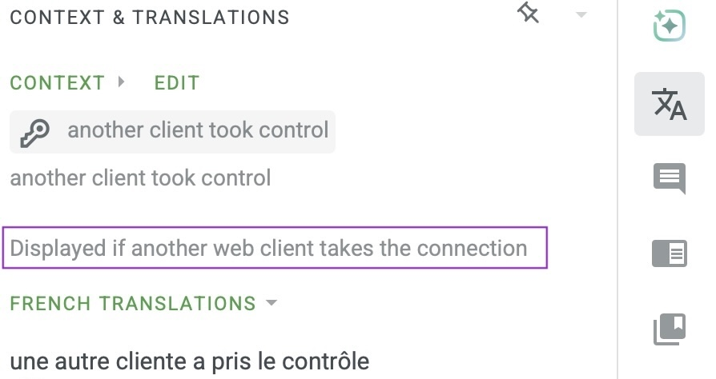

# Translations

[base_loom_server](https://pypi.org/project/base-loom-server/) supports foreign languages.

At the moment, most translations are preliminary.
Help improving the existing translations would be very welcome.
I am also open to supporting additional languages.

Translations can be done on [crowdin](https://crowdin.com/editor/base-loom-server).
Accounts are free and the project is public.

Once you have created an account and logged in, visit the following link to view and edit translations: [French](https://crowdin.com/editor/base-loom-server/5/en-fr?view=side-by-side&filter=basic&value=3). Click on "French" along the top left to pick another language.
If you find it asking for which file to translate, click "default.json".

You can edit each translated string directly in the list view. There are about 65 words and phrases to translate, which are shown in at least 2 pages (if you haven't gotten to "Weft thread" yet, you are not on the last page).

With a bit of extra work, you can also see "context": a string that give more information about the current word or phrase to be translated. This can be very helpful. To show the context:

* If you do not see a panel to the right of the list of strings, click this icon, along the top: .

* Then click on the translation icon along the right to show the correct panel: 

Here is an example showing context in the translation panel for one French phrase. I added a purple box around the context:

Another way to update a translation is to fork the [base_loom_server project on github](https://github.com/r-owen/base_loom_server/) and edit or add a translation file directly.
Here is a link to the [French translation](https://github.com/r-owen/base_loom_server/blob/main/src/base_loom_server/locales/Français.json). The others are in the same place.

## Metadata Keys

There are two special keys that provide metadata:

* **_direction**: whether the language is read left-to-right (value `ltr`, the default) or right-to-left (value `rtl`). If blank, "ltr" is used.
* **_language_code**: the ISO 639-1 language code for the language, e.g. `fr` for `Français`. Here is [one list](https://www.w3schools.com/tags/ref_language_codes.asp). The language code is not very important, but it may help text-to-speech software. If blank "en" is used.
