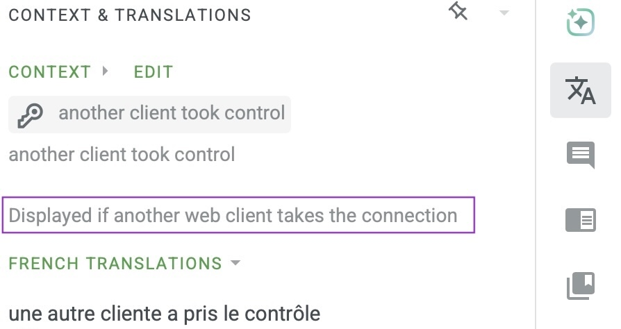

# Translations

[base_loom_server](https://pypi.org/project/base-loom-server/) supports foreign languages.

At the moment all translations are preliminary.
Help improving them and adding new languages would be most welcome.

Translations are done on [crowdin](https://crowdin.com/editor/base-loom-server).
Accounts are free and the project is public.

Here is a good place to start [French](https://crowdin.com/editor/base-loom-server/5/en-fr?view=side-by-side&filter=basic&value=3). Click on French along the top left to pick another language.
If you find it asking for which file to translate, select "default.json".

You can edit strings directly in the list view or in the translate panel to the right.
The translate panel also shows context: a string that give more information about the word or phrase to be translated.
To open the translate panel click on the translate icon along the right:

Here is an example showing the translate panel for one French phrase. I added a purple box around the context, and the translation is shown (and can be edited) in bold at the bottom of the screen shot.

Another way to update a translation is to fork the [base_loom_server project on github](https://github.com/r-owen/base_loom_server/) and edit or add a translation file directly.
Here is a link to the [French translation](https://github.com/r-owen/base_loom_server/blob/main/src/base_loom_server/locales/Français.json).

## Metadata Keys

There are two special keys that provide metadata:

* **_direction**: whether the language is read left-to-right (value `ltr`, the default) or right-to-left (value `rtl`). If blank "ltr" is used.
* **_language_code**: the ISO 639-1 language code for the language, e.g. `fr` for `Français`. Here is [one list](https://www.w3schools.com/tags/ref_language_codes.asp). The language code is not very important, but it may help text-to-speech software. If blank "en" is used.
