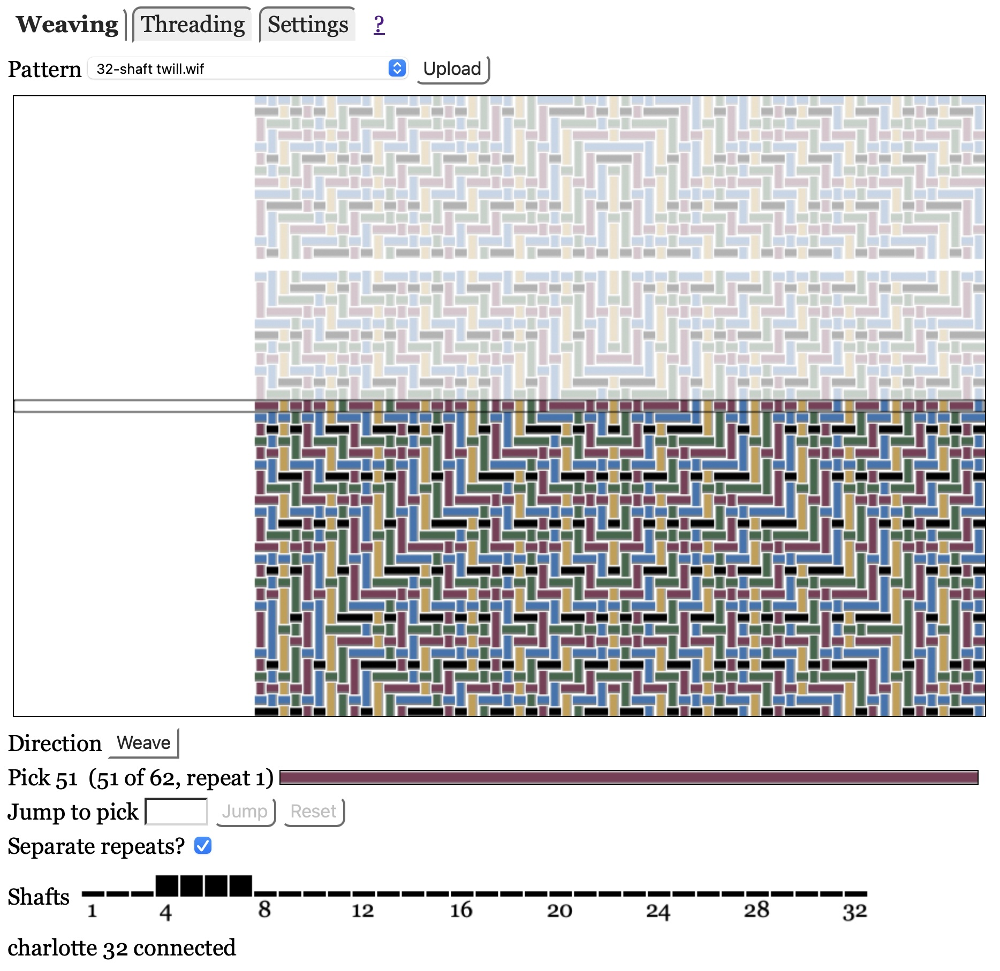
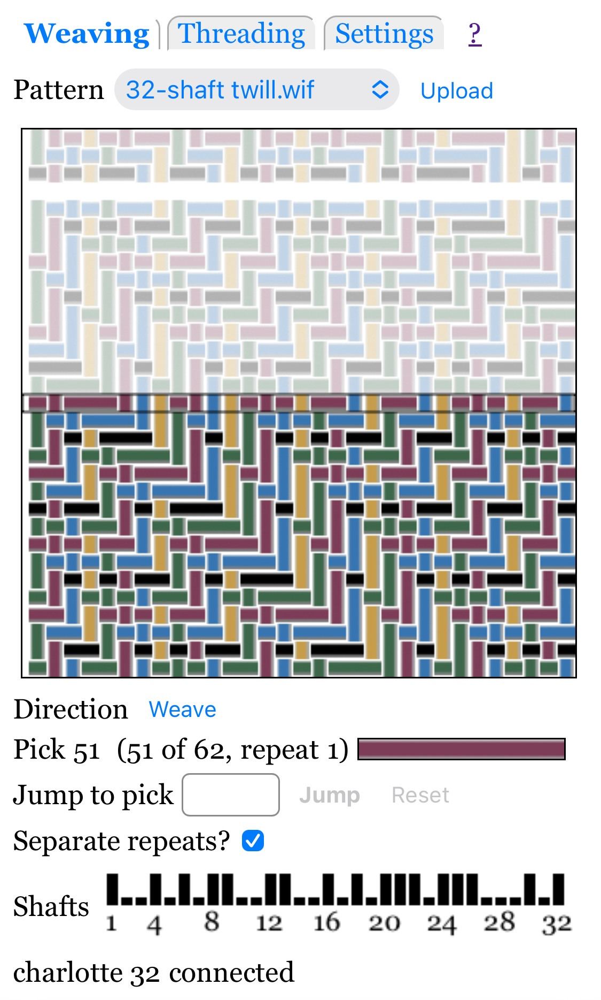

# Weaving

This page assumes you have done all the [basics](index.md):

* Connected your web browser to the loom server
* Uploaded at least one pattern, and selected a pattern from the pattern menu
* Selected the Weaving mode.

## Pattern Display

The pattern is displayed as a picture that shows woven fabric in the bottom half,
and potential future fabric, somewhat grayed out, in the top half.

The unwoven fabric will include a gap between each pattern repeat if "Separate repeats?" is checked.
See [Repeating](#repeating) for more information.

A [setting](settings.md) allows you to specify whether warp end 1 is shown at the right or left.

Note that the display is naive; it shows all threads as the same thickness,
and does not display multi-layer patterns, such as doubleweave, correctly.

## Weave Direction

The Weaving "Direction" button shows "Weave" (in black) or "Unweave" (in red).
[Threading](threading.md) also has a direction button that shows "Thread" (in black) or "Unthread" (in red),
prefixed by an arrow showing the direction of the next group of warp ends.

How you change direction depends on the loom:

* Séguin looms allow you to change direction by pressing the direction button in web browser display,
  or pressing the UNW button on the dobby unit. Both work equally well; use whichever you prefer.

* Toika looms can be operated in one of two ways, specified by **Direction control**
  in the [Settings](settings.md) panel:

    * **Software**: push the direction button (Weave/Unweave if weaving, Thread/Unthread if threading)
        in the web browser display to change direction.
        **The physical REVERSE button on the dobby head is ignored.**

    * **Loom**: press the physical REVERSE button on the dobby head to change direction.
        **Warning: the displayed direction does not update until you command the next pick!**
        This is because Toika looms only report direction when requesting a pick.

* For other looms, see the loom-specific documentation with the software package.

## Pick Color

The long colored rectangle to the right of Pick shows the color of the current pick (blank for pick 0),
or, if you have specified a pick to jump to, then it is the color of that pending pick.

## Jumping

You can jump to a different pick.

Jumping is a two-step process: first you request the jump, then you advance to it by pressing the loom's pedal.
(Two steps are necessary because most looms will not accept an unsolicited command to raise shafts.)
In detail:

* Enter the desired pick in the box on the "Jump to weft thread" line.
  The box will turn pink and the Jump button will be enabled.

* Press the "return" keyboard key or click the "Jump" button on the web page to send the requested jump to the server.
  You will see several changes:

  * The jump input box will have a white background and the jump button will be disabled.

  * The pattern display will show the jump-to pick in the center row, with a dotted box around it.

* Advance to the next pick by pressing the loom's pedal.

* Until you advance to the next pick, you may request a different jump
  (in case you got it wrong the first time) or cancel it.
  To cancel the jump you may do any of the following:

  * Press the "Reset" button to the right of "Jump".

  * Reload the page.

  * Select a new pattern.

## Repeating

The software will automatically repeat patterns if you weave or unweave beyond the end.
The exact behavior is controlled by the "Separate repeats?" checkbox:

* "On" (checked): you must advance twice when you reach an end, before the next set of shafts is raised.
  The first advance will lower all shafts, as a signal that you have finished weaving or unweaving one pattern repeat. That is the "separator".

  This will be displayed as a blank row in the center of the pattern display, and also between repeats
  in the display of unwoven fabric above the center.

* "Off" (unchecked): there is no indication that you have reached the end of the pattern.
  The next pick will be pick 1 of the pattern, if weaving, or the last pick, if unweaving.

The default value of "Separate repeats?" is checked (on) if the pattern has more than 20 picks, unchecked (off) otherwise.
The idea is that frequent separator picks are annoying for short patterns, but having a separator pick is useful for long patterns.

[Threading](threading.md) has a checkbox with the same name that does the same basic thing.
However, the value of the Weaving and Threading "Separate repeats?" checkboxes are independent of each other,
and may also be different for different patterns. They are saved in the pattern database.
