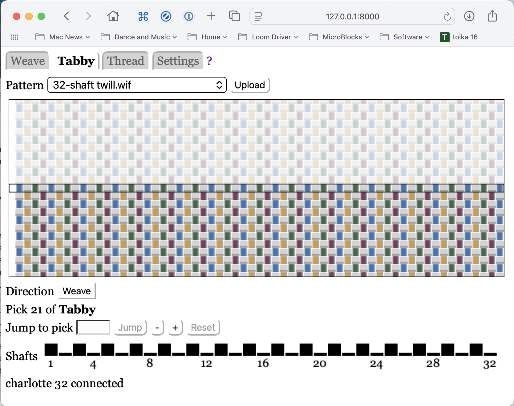
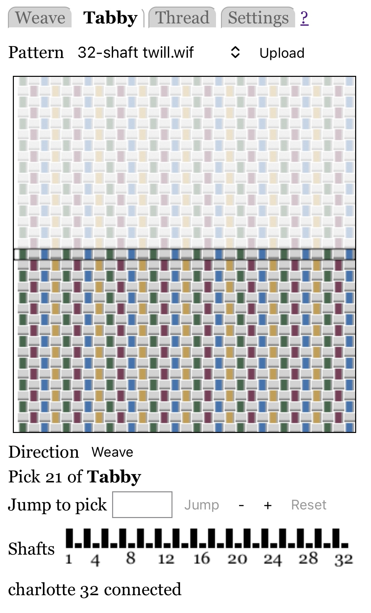

# Weaving Tabby

The **Tabby** mode allows you to weave tabby (plain weave), or a close approximation.
This can be used to weave hems or item separators.

Caveats:

* The software does the best it can to determine suitable tabby picks, but the algorithm is not perfect.
    If you are unsatisified with the tabby pattern, create your own tabby pattern file,
    upload it, and weave it using the Weaving panel.

* This is only intended to weave sections of tabby, not to weave tie down picks interspersed with pattern picks for patterns such as overshot.
    You must include tie-down picks in your weaving pattern files.

The two tabby picks are always opposites: if a shaft is raised in one pick, it will be lowered in the other.
However, shafts beyond the last threaded shaft are always lowered.

The following assumes you have done all the [basics](index.md):

* Connected your web browser to the loom server
* Uploaded at least one pattern, and selected a pattern from the pattern menu
* Selected the Tabby mode.

## Pattern Display

The tabby pattern is displayed as a picture that shows woven tabby fabric in the bottom half,
and potential future fabric, somewhat grayed out, in the top half.

A [setting](settings.md) allows you to specify whether warp end 1 is shown at the right or left.

Note that the display is naive: it shows all threads as the same thickness.

## Weave Direction

The "Direction" button shows "Weave" or "Unweave".

To change between threading and unthreading see [Weaving: Direction](weaving.md#weave-direction).

However, there is rarely any reason to unweave tabby.
Backwards is the same as forwards, except you cannot back up beyond pick 0.

## Jumping

You can jump to a different pick. See [Weaving: Jumping](weaving.md#jumping) for details.

However, there is rarely any reason to jump when weaving tabby.
If you want to skip a pick, just press the loom's pedal again.
